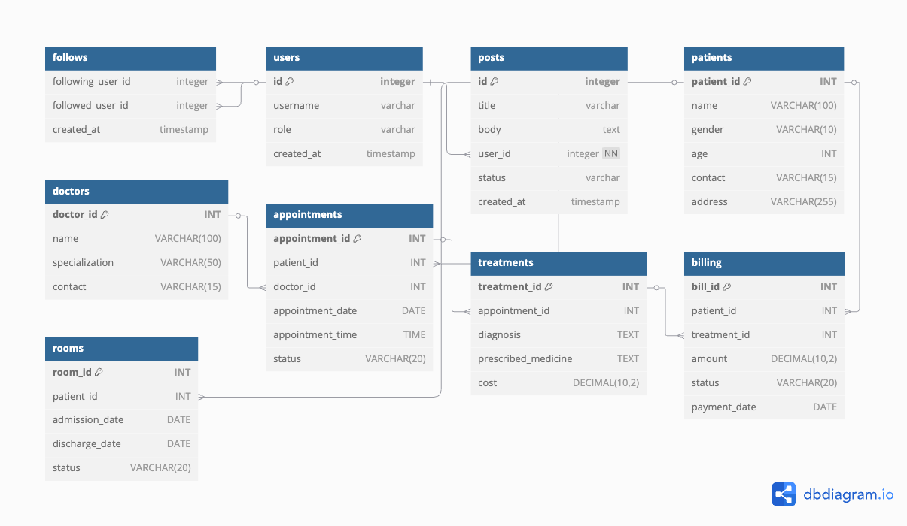

# 🏥 Hospital Management System (SQL Project)

This project simulates a real-world Hospital Management System using MySQL. It is designed to manage key hospital operations such as appointments, treatments, billing, and room assignments using a relational database.

---

## 📌 Project Features

- Relational database design using **MySQL**
- Patient, doctor, treatment, billing, appointment, and room management
- Foreign key constraints to maintain data integrity
- Sample data insertions for simulation
- Real-world SQL queries for analytics and reporting

---

## 🛠 Technologies Used

- MySQL
- SQL Workbench
- SQL Queries (Joins, Aggregations, Subqueries, Indexing)

---

## 🗃 Database Schema

**Tables:**
- `patients` – Patient details
- `doctors` – Doctor information
- `appointments` – Patient-doctor scheduling
- `treatments` – Diagnosis and medicines
- `billing` – Payment tracking
- `rooms` – Admission and discharge status

---

## 🔢 Sample SQL Queries

### 1. Upcoming Appointments
```sql
SELECT a.appointment_id, p.name AS patient_name, d.name AS doctor_name,
       a.appointment_date, a.appointment_time, a.status
FROM appointments a
JOIN patients p ON a.patient_id = p.patient_id
JOIN doctors d ON a.doctor_id = d.doctor_id
WHERE a.status = 'Scheduled'
ORDER BY a.appointment_date, a.appointment_time;
```

### 2. Total Revenue Collected
```sql
SELECT SUM(amount) AS total_revenue
FROM billing
WHERE status = 'Paid';
```

### 3. Current Admitted Patients
```sql
SELECT r.room_id, p.name AS patient_name, r.admission_date, r.status
FROM rooms r
JOIN patients p ON r.patient_id = p.patient_id
WHERE r.status = 'Admitted';
```

### 4. Patient Billing Summary
```sql
SELECT b.bill_id, p.name AS patient_name, t.diagnosis,
       b.amount, b.status, b.payment_date
FROM billing b
JOIN patients p ON b.patient_id = p.patient_id
JOIN treatments t ON b.treatment_id = t.treatment_id;
```
### 5. Doctor’s Daily Schedule
```sql
Copy
Edit
SELECT 
    d.name AS doctor_name,
    a.appointment_date,
    a.appointment_time,
    p.name AS patient_name,
    a.status
FROM appointments a
JOIN doctors d ON a.doctor_id = d.doctor_id
JOIN patients p ON a.patient_id = p.patient_id
WHERE d.name = 'Dr. Mehta'
ORDER BY a.appointment_date, a.appointment_time;
```
 ### 6. Most Recent Treatments Done
```sql
SELECT 
    t.treatment_id,
    p.name AS patient_name,
    t.diagnosis,
    t.prescribed_medicine,
    t.cost
FROM treatments t
JOIN appointments a ON t.appointment_id = a.appointment_id
JOIN patients p ON a.patient_id = p.patient_id
ORDER BY t.treatment_id DESC
LIMIT 5;
```
### 7. Total Number of Appointments Per Doctor
```sql

SELECT 
    d.name AS doctor_name,
    COUNT(a.appointment_id) AS total_appointments
FROM doctors d
JOIN appointments a ON d.doctor_id = a.doctor_id
GROUP BY d.name;
```
### 8. Logging Patient Deletion
```sql
CREATE TRIGGER after_patient_delete
AFTER DELETE ON Patient
FOR EACH ROW
BEGIN
  INSERT INTO Patient_Log (patient_id, action)
  VALUES (OLD.patient_id, 'Deleted');
END;
```
### 9. Auto-update Doctor Schedule
```sql
CREATE TRIGGER after_appointment_insert
AFTER INSERT ON Appointments
FOR EACH ROW
BEGIN
  UPDATE Doctor_Schedule
  SET is_available = 'No'
  WHERE doctor_id = NEW.doctor_id AND appointment_date = NEW.appointment_date;
END;
```
## 🧩 ER Diagram




---

## 🙋‍♀️ Author

**Rutuja Mehare**  
LinkedIn: [linkedin.com/in/rutuja-mehare-a52216252](https://linkedin.com/in/rutuja-mehare-a52216252)  
GitHub: [github.com/Rutu-ja1](https://github.com/Rutu-ja1)

---

⭐ Feel free to fork this project and use it for your portfolio or learning!

